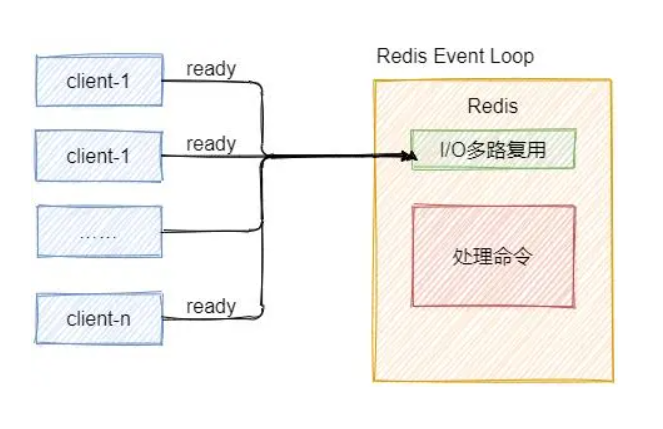
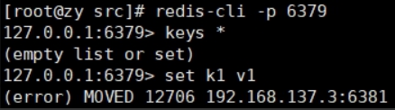

# 1.Redis概述

## 1.1.Redis 介绍

- Redis 是一个开源的 key-value 存储系统。
- 和 Memcached 类似，它支持存储的 value 类型相对更多，包括 string (字符串)、list (链表)、set (集合)、zset (sorted set –有序集合) 和 hash（哈希类型）。
- 这些数据类型都支持 push/pop、add/remove 及取交集并集和差集及更丰富的操作，而且这些操作都是原子性的。
  在此基础上，Redis 支持各种不同方式的排序。
- 与 memcached 一样，为了保证效率，数据都是缓存在内存中。
- 区别的是 Redis 会周期性的把更新的数据写入磁盘或者把修改操作写入追加的记录文件。
- 并且在此基础上实现了 master-slave (主从) 同步。

## 1.2.应用场景

**配合关系型数据库做高速缓存**

- 高频次，热门访问的数据，降低数据库 IO。

- 分布式架构，做 session 共享。


**多样的数据结构存储持久化数据**


## 1.3.相关技术

**Redis 使用的是单线程 + 多路 IO 复用技术：**

多路复用是指使用一个线程来检查多个文件描述符（Socket）的就绪状态，比如调用 select 和 poll 函数，传入多个文件描述符，如果有一个文件描述符就绪，则返回，否则阻塞直到超时。得到就绪状态后进行真正的操作可以在同一个线程里执行，也可以启动线程执行（比如使用线程池）。

**串行 vs 多线程 + 锁（memcached） vs 单线程 + 多路 IO 复用 (Redis)**（与 Memcache 三点不同：支持多数据类型，支持持久化，单线程 + 多路 IO 复用） 。




## 1.4.安装

环境：Centos7

1 查看gcc版本，没有就安装

`gcc --version`

`yun install -y gcc`

2 下载 redis-6.2.1.tar.gz 放在/opt 下

3 解压：`tar -zxvf redis-6.2.1.tar.gz`

4 解压完成进入目录：`cd edis-6.2.1`

5 在 redis-6.2.1 目录执行 make 命令（只是编译好）

6 如果没有C语言环境，make 会报错

7 解决方案：运行 make distclean

8 在 redis-6.2.1 目录再次执行 make 命令（只是编译好）

9 跳过 make test 继续执行：make install

安装目录：/usr/local/bin


## 1.5.操作

前台启动，命令行关闭，redis就会停止（不建议）

`redis-server`

**后台启动（推荐）**

1 备份 redis.conf 到其他目录

`cp /opt/redis-6.2.1/redis.conf /etc`

2 后台启动设置 daemonize no 改为 yes

`vim /etc/redis.conf` 查找 /daem  

3 Redis 启动

```bash
# 需要进入安装目录启动
[root@hecs-233798 redis-6.2.1]# cd /usr/local/bin/
[root@hecs-233798 bin]# ls
cloud-id    cloud-init-per  easy_install      jsondiff   jsonpointer  normalizer       redis-check-aof  redis-cli       redis-server
cloud-init  dump.rdb        easy_install-3.6  jsonpatch  jsonschema   redis-benchmark  redis-check-rdb  redis-sentinel
[root@hecs-233798 bin]# redis-server /etc/redis.conf 
[root@hecs-233798 bin]# 

# 进入客户端
[root@hecs-233798 bin]# redis-cli
127.0.0.1:6379> 
127.0.0.1:6379> ping
PONG
```

4 Redis 关闭

单实例关闭：`redis-cli shutdown`

也可进入终端输入 shutdown

多实例关闭：kill -9 [pid] 或者 redis-cli -p 6379 shutdown

## 1.6.配置文件详解

1 注释掉bind（支持远程访问）


2 protected-mode yes 改为 no （关闭保护模式）

3 daemonize no 改为 yes （后台启动）

其他

logfile "" 输出日志路径


# 2.Redis 数据类型

## Redis 键（key）

keys * # 查看当前库所有 key

exists <key> # 判断某个 key 是否存在

type <key> # 查看 key 的类型

del <key> # 删除指定 key 数据

**unlink <key> ** # 根据 value 选择非阻塞删除：仅将 keys 从 keyspace 元数据中删除，真正删除会在后续异步执行

expire <key> <sec> # 为给定的 key 设置过期时间10秒

ttl <key> # 查看还有多少秒过期，-1永不过期，-2已过期

select <0-15># 切换数据库

dbsize # 查看当前数据库的 key 数量

flushdb # 清空当前库

flushall # 通杀全部库

## 2.1.Redis 字符串（String）

### 概述

- String 是 Redis 最基本的类型，你可以理解成与 Memcached 一模一样的类型，一个 key 对应一个 value。
- String 类型是**二进制安全**的。意味着 Redis 的 string 可以包含任何数据。比如 jpg 图片或者序列化的对象。
- String 类型是 Redis 最基本的数据类型，一个 Redis 中字符串 value 最多可以是 **512M**。

### 命令

set <key> <value>	# 添加键值对

get <key> # 查询对应键的值

append <key> <value> # 将给定的 value 追加到原 value 的末尾

strlen <key> # 获取 value 的长度

setnx <key> <value> # 在 key 不存在时，设置 key value

incr <key> # 将 key 的数字值增加1 ，只能对数字值操作，如果为空那么新值为1

decr <key> # 将 key 的数字值增加1 ，只能对数字值操作，如果为空那么新值为-1

incrby/decrby <key> <step> # 增减 key 的数字值，step 设置步长

mset <k1> <v1> <k2> <v2> ... # 同时设置一个或多个key-value 对

mget <k1> <k2> <k3>... # 同时获取一个或多个value

msetnx <k1> <v1> <k2> <v2> ... # 同时设置一个或多个 key-value 对，当且仅当所有给定 key 都不存在。
**原子性，有一个失败则都失败**

getrange <key> <起始位置> <结束位置> # 获得值的范围，类似java 中的 substring，前包，后包。

```bash
127.0.0.1:6379> set name lucyhahaha
OK
127.0.0.1:6379> getrange name 0 3
"lucy"
```

setrange <key> <起始位置> <value> # 用<value>覆写<key>所储存的字符串值，从<起始位置>开始(**索引从0开始**)。

```bash
127.0.0.1:6379> setrange name 3 abc
(integer) 10
127.0.0.1:6379> get name
"lucabchaha"
```


**setex <key> <过期时间> <value>** # 设置键值的同时，设置过期时间，单位秒。
getset <key> <value> # 以新换旧，设置了新值同时获得旧值。

```bash
127.0.0.1:6379> getset name jack
"lucabchaha"
127.0.0.1:6379> get name
"jack"
```

### 数据结构
String 的数据结构为简单动态字符串 (Simple Dynamic String, 缩写 SDS)，是可以修改的字符串，内部结构实现上类似于 Java 的 ArrayList，采用预分配冗余空间的方式来减少内存的频繁分配.


如图中所示，内部为当前字符串实际分配的空间 capacity 一般要高于实际字符串长度 len。当字符串长度小于 1M 时，扩容都是加倍现有的空间，如果超过 1M，扩容时一次只会多扩 1M 的空间。需要注意的是字符串最大长度为 512M。


## 2.2.Redis 列表（List)

### 概述

单键多值：**Redis** 列表是简单的字符串列表，按照插入顺序排序。你可以添加一个元素到列表的头部（左边）或者尾部（右边）。

它的底层实际是个**双向链表**，对两端的操作性能很高，通过索引下标的操作中间的节点性能会较差。


### 命令
lpush/rpush<key><value1><value2><value3>....从左边/右边插入一个或多个值。

```bash
127.0.0.1:6379> lpush k1 v1 v2 v3
(integer) 3
127.0.0.1:6379> rpush k2 v1 v2 v3
(integer) 3
127.0.0.1:6379> lrange k1 0 -1
1) "v3"
2) "v2"
3) "v1"
127.0.0.1:6379> lrange k2 0 -1
1) "v1"
2) "v2"
3) "v3"
```

lpop/rpop<key>从左边/右边吐出一个值。**值在键在，值光键亡**。

```bash
127.0.0.1:6379> lpop k1
"v3"
127.0.0.1:6379> rpop k2
"v3"
```

rpoplpush<key1><key2>从<key1>列表右边吐出一个值，插到<key2>列表左边。

```bash
127.0.0.1:6379> lpush k1 v1 v2 v3
(integer) 3
127.0.0.1:6379> rpush k2 v11 v12 v13
(integer) 3
127.0.0.1:6379> rpoplpush k1 k2
"v1"
127.0.0.1:6379> lrange k2 0 -1
1) "v1"
2) "v11"
3) "v12"
4) "v13"
```


lrange <key><start><stop>       取值，按照索引下标获得元素（从左到右）

lrange mylist 0 -1      0左边第一个，**-1右边第一个，(0 -1表示获取所有)**

lindex<key><index>     按照索引下标获得元素（从左到右，从0开始）

```bash
127.0.0.1:6379> lrange k2 0 -1
1) "v1"
2) "v11"
3) "v12"
4) "v13"
127.0.0.1:6379> lindex k2 0
"v1"
127.0.0.1:6379> lindex k2 2
"v12"
```

llen<key>     获得列表长度

```bash
127.0.0.1:6379> llen k2
(integer) 4
```

linsert<key>before<value><newvalue>        在<value>的后面插入<newvalue>。

```bash
127.0.0.1:6379> linsert k2 before "v11" "left"
(integer) 5
127.0.0.1:6379> linsert k2 after "v11" "right"
(integer) 6
127.0.0.1:6379> lrange k2 0 -1
1) "v1"
2) "left"
3) "v11"
4) "right"
5) "v12"
6) "v13"
```

lrem<key><n><value>    从左边删除n个value（从左到右）

```bash
127.0.0.1:6379> lrange k2 0 -1
1) "v1"
2) "new"
3) "v11"
4) "new"
5) "v12"
6) "new"
7) "v13"
127.0.0.1:6379> lrem k2 2 'new'
(integer) 2
127.0.0.1:6379> lrange k2 0 -1
1) "v1"
2) "v11"
3) "v12"
4) "new"
5) "v13"
```

lset<key><index><value>将列表key下标为index的值替换成value

```bash
127.0.0.1:6379> lset k2 1 hello
OK
127.0.0.1:6379> lrange k2 0 -1
1) "v1"
2) "hello"
3) "v12"
4) "new"
5) "v13"
```

### 数据结构
List 的数据结构为快速链表 quickList。

首先在列表元素较少的情况下会使用一块连续的内存存储，这个结构是 ziplist，也即是压缩列表。它将所有的元素紧挨着一起存储，分配的是一块连续的内存。


当数据量比较多的时候才会改成 quicklist。因为普通的链表需要的附加指针空间太大，会比较浪费空间。比如这个列表里存的只是 int 类型的数据，结构上还需要两个额外的指针 prev 和 next。


Redis 将链表和 ziplist 结合起来组成了 quicklist。也就是将多个 ziplist 使用双向指针串起来使用。这样既满足了快速的插入删除性能，又不会出现太大的空间冗余。


## 2.3.Redis 集合（Set）

### 概述
Redis set 对外提供的功能与 list 类似，是一个列表的功能，特殊之处在于 set 是可以**自动排重**的，当你需要存储一个列表数据，又不希望出现重复数据时，set 是一个很好的选择，并且 set 提供了判断某个成员是否在一个 set 集合内的重要接口，这个也是 list 所不能提供的。

Redis 的 Set 是 string 类型的**无序集合**。**它底层其实是一个 value 为 null 的 hash 表**，所以添加，删除，查找的 **复杂度都是 O (1)**。

一个算法，随着数据的增加，执行时间的长短，如果是 O (1)，数据增加，查找数据的时间不变。

### 命令

sadd <key><value1><value2>....
将一个或多个member元素加入到集合key中，已经存在的member元素将被忽略

```bash
127.0.0.1:6379> sadd k1 v1 v2 v3
(integer) 3
```

smembers<key>				取出该集合的所有值。

```bash
127.0.0.1:6379> smembers k1
1) "v3"
2) "v1"
3) "v2"
```

sismember<key><value> 			判断集合<key>是否为含有该<value>值，有1，没有0

```bash
127.0.0.1:6379> sismember k1 v1
(integer) 1
127.0.0.1:6379> sismember k1 v11
(integer) 0
```

scard<key>						返回该集合的元素个数。

```bash
127.0.0.1:6379> scard k1
(integer) 3
```

srem<key><value1><value2>….				删除集合中的某个元素。

```bash
127.0.0.1:6379> srem k1 v1 v2
(integer) 2
127.0.0.1:6379> smembers k1
1) "v3"
```

spop<key>					随机从该集合中吐出一个值。

```bash
127.0.0.1:6379> sadd k2 v1 v2 v3 v4
(integer) 4
127.0.0.1:6379> spop k2
"v2"
127.0.0.1:6379> spop k2
"v4"
```

srandmember<key><n>				随机从该集合中取出n个值。不会从集合中删除。

```bash
127.0.0.1:6379> srandmember k2 2
1) "v3"
2) "v1"
```

smove<source><destination>value把集合中一个值从一个集合移动到另一个集合。

```bash
127.0.0.1:6379> sadd k1 v1 v2 v3
(integer) 3
127.0.0.1:6379> sadd k2 v3 v4 v5
(integer) 3
127.0.0.1:6379> smove k1 k2 v3
(integer) 1
127.0.0.1:6379> smembers k1
1) "v1"
2) "v2"
127.0.0.1:6379> smembers k2
1) "v5"
2) "v4"
3) "v3"
```

sinter<key1><key2>返回两个集合的交集元素。

```bash
127.0.0.1:6379> sadd k1 v1 v2 v3
(integer) 3
127.0.0.1:6379> sadd k2 v3 v4 v5
(integer) 3
127.0.0.1:6379> sinter k1 k2
1) "v3"
```

sunion<key1><key2>返回两个集合的并集元素。

```bash
127.0.0.1:6379> sunion k1 k2
1) "v2"
2) "v3"
3) "v1"
4) "v5"
5) "v4"
```

sdif<key1><key2>返回两个集合的差集元素（key1-key2）

```bash
127.0.0.1:6379> sdiff k1 k2
1) "v1"
2) "v2"
```

### 数据结构
Set 数据结构是 dict 字典，字典是用哈希表实现的。
Java 中 HashSet 的内部实现使用的是 HashMap，只不过所有的 value 都指向同一个对象。Redis 的 set 结构也是一样，它的内部也使用 hash 结构，所有的 value 都指向同一个内部值。

## 2.4.Redis 哈希（Hash）

### 概述
Redis hash 是一个键值对集合。

Redis hash 是一个 string 类型的 **field** 和 **value** 的映射表，hash 特别适合用于存储对象。

类似 Java 里面的 Map<String,Object>。


用户 ID 为查找的 key，存储的 value 用户对象包含姓名，年龄，生日等信息，如果用普通的 key/value 结构来存储，主要有以下 2 种存储方式：


方法一：每次修改用户的某个属性需要，先反序列化改好后再序列化回去。开销较大。

方法二：用户 ID 数据冗余。


通过 key (用户 ID) + field (属性标签) 就可以操作对应属性数据了，既不需要重复存储数据，也不会带来序列化和并发修改控制的问题。

### 命令

hset<key><field><value>		给<key>集合中的<field>键赋值<value>

```bash
127.0.0.1:6379> hset user:1001 id 1
(integer) 1
127.0.0.1:6379> hset user:1001 name zhangsan
(integer) 1
```

hget<key><field>					从<key1>集合<field>取出value

```bash
127.0.0.1:6379> hget user:1001 id
"1"
127.0.0.1:6379> hget user:1001 name
"zhangsan"
```

hmset<key><field1><value1><field2><value2>				....批量设置hash的值

```bash
127.0.0.1:6379> hmset user:1002 id 2 name lisi
OK
```

hexists<key><field>			查看哈希表key中，给定域feld是否存在。

```bash
127.0.0.1:6379> hexists user:1002 name
(integer) 1
127.0.0.1:6379> hexists user:1002 age
(integer) 0
```

hkeys<key>				列出该hash集合的所有field

```bash
127.0.0.1:6379> hkeys user:1001
1) "id"
2) "name"
```

hvals<key>				列出该hash集合的所有value

```bash
127.0.0.1:6379> hvals user:1001
1) "1"
2) "zhangsan"
```

hincrby<key><field><increment>			为哈希表key中的域field的值加上增量1 -1

```bash
127.0.0.1:6379> hincrby user:1002 age 2
(integer) 32
```

hsetnx<key><field><value>			将哈希表key中的域field的值设置为value，当且仅当域field不存在。

```bash
127.0.0.1:6379> hsetnx user:1002 age 40
(integer) 0
127.0.0.1:6379> hsetnx user:1002 gender 1
(integer) 1
```

### 数据结构
Hash 类型对应的数据结构是两种：ziplist（压缩列表），hashtable（哈希表）。当 field-value 长度较短且个数较少时，使用 ziplist，否则使用 hashtable。


## 2.5.Redis 有序集合 Zest（Sorted Set）

### 概述
Redis 有序集合 zset 与普通集合 set 非常相似，是一个**没有重复元素**的字符串集合。

不同之处是有序集合的每个成员都关联了一个**评分（score）**，这个评分（score）被用来按照从最低分到最高分的方式排序集合中的成员。**集合的成员是唯一的，但是评分可以是重复了** 。

因为元素是有序的，所以你也可以很快的根据评分（score）或者次序（position）来获取一个范围的元素。

访问有序集合的中间元素也是非常快的，因此你能够使用有序集合作为一个没有重复成员的智能列表。

### 命令

zadd <key><score1><value1><score2><value2>...
将一个或多个member元素及其score值加入到有序集key当中。

```bash
127.0.0.1:6379> zadd topn 200 java 300 c++ 400 mysql 500 php
(integer) 4
```

zrange <key><start><stop> [WITHSCORES]
返回有序集key中，下标在<start><stop>之间的元素
带WITHSCORES，可以让分数一起和值返回到结果集。

```bash
127.0.0.1:6379> zrange topn 0 -1
1) "java"
2) "c++"
3) "mysql"
4) "php"
127.0.0.1:6379> zrange topn 0 -1 withscores
1) "java"
2) "200"
3) "c++"
4) "300"
5) "mysql"
6) "400"
7) "php"
8) "500"
```

zrangebyscore key minmax [withscores] [limit offset count]
返回有序集key中，所有score值介于min和max之间(包括等于min或max)的成员。
有序集成员按score值递增（从小到大）次序排列。

```bash
127.0.0.1:6379> zrangebyscore topn 300 400
1) "c++"
2) "mysql"
127.0.0.1:6379> zrangebyscore topn 300 400 withscores
1) "c++"
2) "300"
3) "mysql"
4) "400"
```

zrevrangebyscore key maxmin [withscores] [limit offset count]
同上，改为从大到小排列。

```bash
127.0.0.1:6379> zrevrangebyscore topn 500 200
1) "php"
2) "mysql"
3) "c++"
4) "java"
127.0.0.1:6379> zrevrangebyscore topn 500 200 withscores
1) "php"
2) "500"
3) "mysql"
4) "400"
5) "c++"
6) "300"
7) "java"
8) "200"
```

zincrby <key><increment><value>为元素的score加上增量

```bash
127.0.0.1:6379> zincrby topn 50 java
"250"
```

zrem<key><value>删除该集合下，指定值的元素

```bash
127.0.0.1:6379> zrem topn java
(integer) 1
```

zcount<key><min><max>统计该集合，分数区间内的元素个数

```bash
127.0.0.1:6379> zcount topn 200 300
(integer) 2
```

zrank<key><value>返回该值在集合中的排名，从0开始。

```bash
127.0.0.1:6379> zrank topn mysql
(integer) 2
```

案例：如何利用zst实现一个文章访问量的排行榜？


### 数据结构

SortedSet (zset) 是 Redis 提供的一个非常特别的数据结构，一方面它等价于 Java 的数据结构 Map<String, Double>，可以给每一个元素 value 赋予一个权重 score，另一方面它又类似于 TreeSet，内部的元素会按照权重 score 进行排序，可以得到每个元素的名次，还可以通过 score 的范围来获取元素的列表。

zset 底层使用了两个数据结构：

- hash，hash 的作用就是关联元素 value 和权重 score，保障元素 value 的唯一性，可以通过元素 value 找到相应的 score 值。


- 跳跃表，跳跃表的目的在于给元素 value 排序，根据 score 的范围获取元素列表。


### 跳跃表
**简介**

有序集合在生活中比较常见，例如根据成绩对学生排名，根据得分对玩家排名等。对于有序集合的底层实现，可以用数组、平衡树、链表等。数组不便元素的插入、删除；平衡树或红黑树虽然效率高但结构复杂；链表查询需要遍历所有效率低。Redis 采用的是跳跃表，跳跃表效率堪比红黑树，实现远比红黑树简单。

**实例**

对比有序链表和跳跃表，从链表中查询出 51：

1 有序链表


要查找值为 51 的元素，需要从第一个元素开始依次查找、比较才能找到。共需要 6 次比较。

2 跳跃表


- 从第 2 层开始，1 节点比 51 节点小，向后比较；

- 21 节点比 51 节点小，继续向后比较，后面就是 NULL 了，所以从 21 节点向下到第 1 层；

- 在第 1 层，41 节点比 51 节点小，继续向后，61 节点比 51 节点大，所以从 41 向下；

- 在第 0 层，51 节点为要查找的节点，节点被找到，共查找 4 次。

从此可以看出跳跃表比有序链表效率要高。

## Redis Bitmaps

### 概述
Redis 提供了 Bitmaps 这个 “数据类型” 可以实现对位的操作：

- Bitmaps 本身不是一种数据类型， 实际上它就是字符串（key-value） ， 但是它可以对字符串的位进行操作。

- Bitmaps 单独提供了一套命令， 所以在 Redis 中使用 Bitmaps 和使用字符串的方法不太相同。 可以把 Bitmaps 想象成一个以位为单位的数组， 数组的每个单元只能存储 0 和 1， 数组的下标在 Bitmaps 中叫做偏移量。

### 命令

1、setbit

（1）格式
setbit<key><offset><value>设置 Bitmaps 中某个偏移量的值(0 或1)
*offset:偏移量从 0 开始
（2）实例 
每个独立用户是否访问过网站存放在Bitmaps中，将访问的用户记做1，没有访问的用户记做0，用偏移量作为用户的id.
设置键的第offset个位的值(从0算起)，假设现在有20个用户，userid=1,6,11,15,19的用户对网站进行了访问，那么当前Bitmaps初始化结果如图


```bash
127.0.0.1:6379> setbit users:20230101 1 1
(integer) 0
127.0.0.1:6379> setbit users:20230101 6 1
(integer) 0
127.0.0.1:6379> setbit users:20230101 11 1
(integer) 0
127.0.0.1:6379> setbit users:20230101 15 1
(integer) 0
127.0.0.1:6379> setbit users:20230101 19 1
(integer) 0
```


2、getbit
(1)格式
getbit<key><offset>获取Bitmaps中某个偏移量的值。
获取键的第offset位的值(从0开始算)，
(2)实例
获取id=8的用户是否在2023-01-01这天访问过，返回0说明没有访问过：

```bash
127.0.0.1:6379> getbit users:20230101 6
(integer) 1
127.0.0.1:6379> getbit users:20230101 7
(integer) 0
```


3、bitcount
统计字符串被设置为1的bt数。一般情况下，给定的整个字符串都会被进行计数，通
过指定额外的start或end参数，可以让计数只在特定的位上进行。start和end参数
的设置，都可以使用负数值：比如-1表示最后一个位，而-2表示倒数第二个位，
stat、end是指bit组的字节的下标数，二者皆包含。

（1）格式
bitcount <key> [start end]统计字符串从stat字节到end字节比特值为1的数量

（2）实例
计算2023-01-01这天的独立访问用户数量：

```bash
127.0.0.1:6379> bitcount users:20230101
(integer) 5
```

4、bitop

(1)格式
bitop and(or/not/xor)<destkey>[key...]
bitop是一个复合操作，它可以做多个Bitmaps的and（交集）、or（并集）、not
（非）、or（异或）操作并将结果保存在destkey中。

(2)实例
2020-11-04日访问网站的userid=1,2,5,9。
setbit users:20201104 1 1
setbit users:20201104 2 1
setbit users:20201104 5 1
setbit users:20201104 9 1

2020-11-03日访问网站的userid=0,1,4,9。
setbit users:20201103 0 1
setbit users:20201103 1 1
setbit users:20201103 4 1
setbit users:20201103 9 1
计算出两天都访问过网站的用户数量

```bash
############### 命令 #参数# 目标key ################ key1 ########## key2 #########
127.0.0.1:6379> bitop and users:and:20201104_03 users:20201104 users:20201103
(integer) 2
127.0.0.1:6379> keys *
1) "users:and:20201104_03"
2) "users:20201104"
3) "users:20201103"
```


### Bitmaps 与 set 对比
假设网站有 1 亿用户， 每天独立访问的用户有 5 千万， 如果每天用集合类型和 Bitmaps 分别存储活跃用户可以得到表：

| set 和 Bitmaps 存储一天活跃用户对比 |                      |                  |                           |
| :---------------------------------- | -------------------- | ---------------- | ------------------------- |
| 数据类型                            | 每个用户 id 占用空间 | 需要存储的用户量 | 全部内存量                |
| 集合                                | 64 位                | 50000000         | 64 位 * 50000000 = 400MB  |
| Bitmaps                             | 1 位                 | 100000000        | 1 位 * 100000000 = 12.5MB |


很明显， 这种情况下使用 Bitmaps 能节省很多的内存空间， 尤其是随着时间推移节省的内存还是非常可观的。

| set 和 Bitmaps 存储独立用户空间对比 |        |        |       |
| ----------------------------------- | ------ | ------ | ----- |
| 数据类型                            | 一天   | 一个月 | 一年  |
| 集合                                | 400MB  | 12GB   | 144GB |
| Bitmaps                             | 12.5MB | 375MB  | 4.5GB |

但 Bitmaps 并不是万金油， 假如该网站每天的独立访问用户很少， 例如只有 10 万（大量的僵尸用户） ， 那么两者的对比如下表所示， 很显然， 这时候使用 Bitmaps 就不太合适了， 因为基本上大部分位都是 0。

| set 和 Bitmaps 存储一天活跃用户对比（用户比较少） |                      |                  |                           |
| ------------------------------------------------- | -------------------- | ---------------- | ------------------------- |
| 数据类型                                          | 每个 userid 占用空间 | 需要存储的用户量 | 全部内存量                |
| 集合                                              | 64 位                | 100000           | 64 位 * 100000 = 800KB    |
| Bitmaps                                           | 1 位                 | 100000000        | 1 位 * 100000000 = 12.5MB |

## HyperLogLog

在工作当中，我们经常会遇到与统计相关的功能需求，比如统计网站 PV（PageView 页面访问量），可以使用 Redis 的 incr、incrby 轻松实现。但像 UV（UniqueVisitor 独立访客）、独立 IP 数、搜索记录数等需要去重和计数的问题如何解决？这种求集合中不重复元素个数的问题称为基数问题。

解决基数问题有很多种方案：

1、数据存储在 MySQL 表中，使用 distinct count 计算不重复个数。

2、使用 Redis 提供的 hash、set、bitmaps 等数据结构来处理。

以上的方案结果精确，但随着数据不断增加，导致占用空间越来越大，对于非常大的数据集是不切实际的。能否能够降低一定的精度来平衡存储空间？Redis 推出了 HyperLogLog。

- Redis HyperLogLog 是用来做基数统计的算法，HyperLogLog 的优点是：在输入元素的数量或者体积非常非常大时，计算基数所需的空间总是固定的、并且是很小的。

- 在 Redis 里面，每个 HyperLogLog 键只需要花费 12 KB 内存，就可以计算接近 2^64 个不同元素的基数。这和计算基数时，元素越多耗费内存就越多的集合形成鲜明对比。

- 但是，因为 HyperLogLog 只会根据输入元素来计算基数，而不会储存输入元素本身，所以 HyperLogLog 不能像集合那样，返回输入的各个元素。

什么是基数？

比如数据集 {1, 3, 5, 7, 5, 7, 8}，那么这个数据集的基数集为 {1, 3, 5 ,7, 8}，基数 (不重复元素) 为 5。 基数估计就是在误差可接受的范围内，快速计算基数。

### 命令

1、pfadd
（1）格式
pfadd <key><element>[element...]添加指定元素到HyperLogLog中，

（2）实例

```bash
127.0.0.1:6379> pfadd utils "java" "python" "mysql"
(integer) 1
127.0.0.1:6379> pfadd utils "java" 
(integer) 0
```


2、pfcount
（1）格式
pfcount<key>[key...]计算**HLL的近似基数**，可以计算多个HLL,比如用HLL存储每
天的UV,计算一周的UV可以使用7天的UV合并计算即可

（2）实例

```bash
127.0.0.1:6379> pfcount utils
(integer) 3
```


3、pfmerge
（1）格式
pfmerge<destkey><sourcekey>[sourcekey...]将一个或多个HLL合并后的结果存
储在另一个HLL中，比如每月活跃用户可以使用每天的活跃用户来合并计算可得

（2）实例

```bash
127.0.0.1:6379> pfadd k1 'a' 'b' 'c'
(integer) 1
127.0.0.1:6379> pfmerge k100 k1 utils
OK
127.0.0.1:6379> pfcount k100
(integer) 6
```


## Geospatial
Redis 3.2 中增加了对 GEO 类型的支持。GEO，Geographic，地理信息的缩写。该类型，就是元素的 2 维坐标，在地图上就是经纬度。redis 基于该类型，提供了经纬度设置，查询，范围查询，距离查询，经纬度 Hash 等常见操作。

### 命令

1、geoadd
（1）格式
geoadd<key><longitude><latitude><member>[longitude latitude member...]
加地理位置(经度，纬度，名称)

（2）实例
geoadd china:city 121.47 31.23 shanghai
geoadd china:city 106.50 29.53 chongqing 114.05 22.52 shenzhen 116.38 39.90 beijing

```bash
127.0.0.1:6379> geoadd china:city 121.47 31.23 shanghai
(integer) 1
127.0.0.1:6379> geoadd china:city 106.50 29.53 chongqing 114.05 22.52 shenzhen 116.38 39.90 beijing
(integer) 3
```


两极无法直接添加，一般会下载城市数据，直接通过Java程序一次性导入。
有效的经度从-180度到180度。有效的纬度从-85.05112878度到
85.05112878度。

当坐标位置超出指定范围时，该命令将会返回一个错误。
已经添加的数据，是无法再次往里面添加的。

2、geopos
（1）格式
geopos<key><member>[member...]获得指定地区的坐标值

（2）实例

```bash
127.0.0.1:6379> geopos china:city beijing
1) 1) "116.38000041246414185"
   2) "39.90000009167092543"
127.0.0.1:6379> geopos china:city shanghai
1) 1) "121.47000163793563843"
   2) "31.22999903975783553"
```

3、geodist,
（1）格式
geodist<key><member1><member2>[m|km|ft|mi]获取两个位置之间的直线距离

（2）实例
获取两个位置之间的直线距离。

```bash
127.0.0.1:6379> geodist china:city beijing shanghai
"1068153.5181"
```

单位：
表示单位为米【默认值】。
km表示单位为千米。
mi表示单位为英里。
什表示单位为英尺。
如果用户没有显式地指定单位参数，那么GEODIST默认使用米作为单位

4、georadius
（1）格式
georadius<key><longitude><latitude>radius m|km|ft|mi
以给定的经纬度为中心，找出某一半径内的元素

经度 纬度 距离 单位
（2）实例

```bash
127.0.0.1:6379> georadius china:city 110 30 1000 km
1) "chongqing"
2) "shenzhen"
```


# 3.Redis 的发布和订阅

## 3.1什么是发布和订阅

- Redis发布订阅(pub/sub)是一种消息通信模式：发送者(pub)发送消息，订阅者(sub)接收消息。
- Redis客户端可以订阅任意数量的频道。

## 3.2Redis 的发布和订阅

客户端可以订阅频道如下图：


当给这个频道发布消息后，消息就会发送给订阅的客户端：


## 3.3发布订阅命令行实现

打开一个客户端订阅 channel1：

```bash
127.0.0.1:6379> SUBSCRIBE channel1
Reading messages... (press Ctrl-C to quit)
1) "subscribe"
2) "channel1"
3) (integer) 1
```

打开另一个客户端，给 channel1 发布消息 hello：

```bash
127.0.0.1:6379> publish channel1 hello!
(integer) 1
```

打开第一个客户端可以看到发送的消息：

```bash
127.0.0.1:6379> SUBSCRIBE channel1
Reading messages... (press Ctrl-C to quit)
1) "subscribe"
2) "channel1"
3) (integer) 1
1) "message"
2) "channel1"
3) "hello!"
```


# 4.Redis 事务、锁机制秒杀
## 4.1.Redis 事务定义
Redis 事务是一个单独的隔离操作：事务中的所有命令都会序列化、按顺序地执行。事务在执行的过程中，不会被其他客户端发送来的命令请求所打断。

Redis 事务的主要作用就是**串联多个命令**防止别的命令插队。

## 4.2.Multi、Exec、discard
Redis 事务中有 Multi、Exec 和 discard 三个指令，在 Redis 中，从输入 Multi 命令开始，输入的命令都会依次进入命令队列中，但不会执行，直到输入 Exec 后，Redis 会将之前的命令队列中的命令依次执行。而组队的过程中可以通过 discard 来放弃组队。


案例说明：

```bash
127.0.0.1:6379> multi
OK
127.0.0.1:6379(TX)> set k1 v1
QUEUED
127.0.0.1:6379(TX)> set k2 v2
QUEUED
127.0.0.1:6379(TX)> exec
1) OK
2) OK
```

组队成功，提交成功。

```bash
127.0.0.1:6379(TX)> set b1 v1
QUEUED
127.0.0.1:6379(TX)> set b2
(error) ERR wrong number of arguments for 'set' command
127.0.0.1:6379(TX)> exec
(error) EXECABORT Transaction discarded because of previous errors.
```

组队期间报错，执行失败，所有的命令都不执行。

```bash
127.0.0.1:6379(TX)> set c1 v1
QUEUED
127.0.0.1:6379(TX)> incr c1
QUEUED
127.0.0.1:6379(TX)> set c2 v2
QUEUED
127.0.0.1:6379(TX)> exec
1) OK
2) (error) ERR value is not an integer or out of range
3) OK
```

组队成功，执行失败，只有失败的命令不执行。

## 4.3.事务的错误处理
组队中某个命令出现了报告错误，执行时整个的所有队列都会被取消。


如果执行阶段某个命令报出了错误，则只有报错的命令不会被执行，而其他的命令都会执行，不会回滚。


## 4.4.为什么要做成事务
想想一个场景：有很多人有你的账户，同时去参加双十一抢购。

## 4.5.事务冲突的问题
例子

一个请求想给金额减 8000；

一个请求想给金额减 5000；

一个请求想给金额减 1000。

最终我们可以发现，总共金额是 10000，如果请求全部执行，那最后的金额变为 - 4000，很明显不合理。


悲观锁


**悲观锁 (Pessimistic Lock)**，顾名思义，就是很悲观，每次去拿数据的时候都认为别人会修改，所以每次在拿数据的时候都会上锁，这样别人想拿这个数据就会 block 直到它拿到锁。**传统的关系型数据库里边就用到了很多这种锁机制**，比如**行锁**，**表锁**等，**读锁**，**写锁**等，都是在做操作之前先上锁。

乐观锁


**乐观锁 (Optimistic Lock)**，顾名思义，就是很乐观，每次去拿数据的时候都认为别人不会修改，所以不会上锁，但是在更新的时候会判断一下在此期间别人有没有去更新这个数据，可以使用版本号等机制。**乐观锁适用于多读的应用类型，这样可以提高吞吐量**。**Redis 就是利用这种 check-and-set 机制实现事务的**。

WATCH key [key …]

在执行 multi 之前，先执行 watch key1 [key2]，可以监视一个 (或多个) key ，如果在**事务执行之前这个 (或这些) key 被其他命令所改动，那么事务将被打断。**

Clint1先执行，成功

```bash
127.0.0.1:6379> set money 100
OK
127.0.0.1:6379> watch money
OK
127.0.0.1:6379> multi
OK
127.0.0.1:6379(TX)> incrby money 10
QUEUED
127.0.0.1:6379(TX)> exec
1) (integer) 110
```

Clint2后执行，版本号不一致，提交失败

```bash
127.0.0.1:6379> watch money
OK
127.0.0.1:6379> multi
OK
127.0.0.1:6379(TX)> incrby money 20
QUEUED
127.0.0.1:6379(TX)> exec
(nil)
```


unwatch

取消 WATCH 命令对所有 key 的监视。如果在执行 WATCH 命令之后，EXEC 命令或 DISCARD 命令先被执行了的话，那么就不需要再执行 UNWATCH 了。

## 4.6.Redis 事务三特性
- 单独的隔离操作 ：事务中的所有命令都会序列化、按顺序地执行。事务在执行的过程中，不会被其他客户端发送来的命令请求所打断。

- 没有隔离级别的概念 ：队列中的命令没有提交之前都不会实际被执行，因为事务提交前任何指令都不会被实际执行。

- 不保证原子性 ：事务中如果有一条命令执行失败，其后的命令仍然会被执行，没有回滚 。


# 5.Redis_事务秒杀案例
## 5.1.解决计数器和人员记录的事务操作


## 5.2.Redis 事务 — 秒杀并发模拟
> 使用工具 ab 模拟测试：

> - CentOS6 默认安装

> - CentOS7 需要手动安装

**通过 ab 测试**

im postfile 模拟表单提交参数， 以 & 符号结尾，存放当前目录。

内容：prodid=0101&

执行：ab -n 2000 -c 200 -k -p ~/postfile -T application/x-www-form-urlencoded

访问：http://192.168.2.115:8081/Seckill/doseckill

**超卖**


## 5.3.超卖问题


**利用乐观锁淘汰用户，解决超卖问题。**


**主要代码：**

```java
public class SecKill_redis {

	public static void main(String[] args) {
		Jedis jedis =new Jedis("192.168.44.168",6379);
		System.out.println(jedis.ping());
		jedis.close();
	}

	//秒杀过程
	public static boolean doSecKill(String uid,String prodid) throws IOException {
		//1 uid和prodid非空判断
		if(uid == null || prodid == null) {
			return false;
		}

		//2 连接redis
		//Jedis jedis = new Jedis("192.168.44.168",6379);
		//通过连接池得到jedis对象
		JedisPool jedisPoolInstance = JedisPoolUtil.getJedisPoolInstance();
		Jedis jedis = jedisPoolInstance.getResource();

		//3 拼接key
		// 3.1 库存key
		String kcKey = "sk:"+prodid+":qt";
		// 3.2 秒杀成功用户key
		String userKey = "sk:"+prodid+":user";

		//监视库存
		jedis.watch(kcKey);

		//4 获取库存，如果库存null，秒杀还没有开始
		String kc = jedis.get(kcKey);
		if(kc == null) {
			System.out.println("秒杀还没有开始，请等待");
			jedis.close();
			return false;
		}

		// 5 判断用户是否重复秒杀操作
		if(jedis.sismember(userKey, uid)) {
			System.out.println("已经秒杀成功了，不能重复秒杀");
			jedis.close();
			return false;
		}

		//6 判断如果商品数量，库存数量小于1，秒杀结束
		if(Integer.parseInt(kc)<=0) {
			System.out.println("秒杀已经结束了");
			jedis.close();
			return false;
		}

		//7 秒杀过程
		//使用事务
		Transaction multi = jedis.multi();

		//组队操作
		multi.decr(kcKey);
		multi.sadd(userKey,uid);

		//执行
		List<Object> results = multi.exec();

		if(results == null || results.size()==0) {
			System.out.println("秒杀失败了....");
			jedis.close();
			return false;
		}

		//7.1 库存-1
		//jedis.decr(kcKey);
		//7.2 把秒杀成功用户添加清单里面
		//jedis.sadd(userKey,uid);

		System.out.println("秒杀成功了..");
		jedis.close();
		return true;
	}
}


```


## 5.4.继续增加并发测试
**连接有限制**

增加 - r 参数，-r Don’t exit on socket receive errors。

**已经秒光，可是还有库存**

已经秒光，可是还有库存。原因：乐观锁导致很多请求都失败。先点的没秒到，后点的可能秒到了。


**连接超时，通过连接池解决**

节省每次连接 redis 服务带来的消耗，把连接好的实例反复利用。通过参数管理连接的行为，代码见项目中：

连接池参数：

- MaxTotal：控制一个 pool 可分配多少个 jedis 实例，通过 pool.getResource () 来获取；如果赋值为 - 1，则表示不限制；如果 pool 已经分配了 MaxTotal 个 jedis 实例，则此时 pool 的状态为 exhausted。

- maxIdle：控制一个 pool 最多有多少个状态为 idle (空闲) 的 jedis 实例；

- MaxWaitMillis：表示当 borrow 一个 jedis 实例时，最大的等待毫秒数，如果超过等待时间，则直接抛 JedisConnectionException；

- testOnBorrow：获得一个 jedis 实例的时候是否检查连接可用性（ping ()）；如果为 true，则得到的 jedis 实例均是可用的。

## 5.5.解决库存遗留问题
LUA 脚本在 Redis 中的优势

- 将复杂的或者多步的 redis 操作，写为一个脚本，一次提交给 redis 执行，减少反复连接 redis 的次数，提升性能。

- LUA 脚本是类似 redis 事务，有一定的原子性，不会被其他命令插队，可以完成一些 redis 事务性的操作。

- 但是注意 redis 的 lua 脚本功能，只有在 Redis 2.6 以上的版本才可以使用。

- 利用 lua 脚本淘汰用户，解决超卖问题，redis 2.6 版本以后，通过 lua 脚本解决**争抢问题**，实际上是 **redis 利用其单线程的特性，用任务队列的方式解决多任务并发问题**。


# 6.Redis 持久化之 RDB
## 6.1.总体介绍
> 官网介绍：http://www.redis.io

Redis 提供了 2 个不同形式的持久化方式：

- RDB（Redis DataBase）

- AOF（Append Of File）

## 6.2.RDB
### 6.2.1.简介
在指定的时间间隔内将内存中的数据集快照写入磁盘， 也就是行话讲的 Snapshot 快照，它恢复时是将快照文件直接读到内存里。

### 6.1.2.备份是如何执行的
Redis 会单独创建（fork）一个子进程来进行持久化，首先会将数据写入到一个临时文件中，待持久化过程都结束了，再用这个临时文件替换上次持久化好的文件。整个过程中，主进程是不进行任何 IO 操作的，这就确保了极高的性能。如果需要进行大规模数据的恢复，且对于数据恢复的完整性不是非常敏感，那 RDB 方式要比 AOF 方式更加的高效。**RDB 的缺点是服务器挂掉前未持久化的数据可能丢失**。

### 6.2.3.Fork
- Fork 的作用是复制一个与当前进程一样的进程。新进程的所有数据（变量、环境变量、程序计数器等） 数值都和原进程一致，但是是一个全新的进程，并作为原进程的子进程。

- 在 Linux 程序中，fork () 会产生一个和父进程完全相同的子进程，但子进程在此后多会 exec 系统调用，出于效率考虑，Linux 中引入了 “**写时复制技术**”。

- **一般情况父进程和子进程会共用同一段物理内存**，只有进程空间的各段的内容要发生变化时，才会将父进程的内容复制一份给子进程。

### 6.2.4.RDB 持久化流程


### 

### 6.2.5.dump.rdb 文件

在 redis.conf 中配置文件名称，默认为 dump.rdb。

rdb 文件的保存路径，也可以修改。默认为 Redis 启动时命令行所在的目录下 “dir ./”

### 6.2.6如何触发 RDB 快照；保持策略

**配置文件中默认的快照配置**


**命令 save VS bgsave**

- save ：save 时只管保存，其它不管，全部阻塞。手动保存，不建议。

- **bgsave：Redis 会在后台异步进行快照操作， 快照同时还可以响应客户端请求。**

- 可以通过 lastsave 命令获取最后一次成功执行快照的时间。

**flushall 命令**

执行 flushall 命令，也会产生 dump.rdb 文件，但里面是空的，无意义。

### 6.2.7.优势
- 适合大规模的数据恢复
- 对数据完整性和一致性要求不高更适合使用
- 节省磁盘空间
- 恢复速度快


### 6.2.8.劣势

- Fork 的时候，内存中的数据被克隆了一份，大致 2 倍的膨胀性需要考虑。

- 虽然 Redis 在 fork 时使用了写时拷贝技术，但是如果数据庞大时还是比较消耗性能。

- 在备份周期在一定间隔时间做一次备份，所以如果 Redis 意外 down 掉的话，就会丢失最后一次快照后的所有修改。

### 6.2.9.如何停止
动态停止 RDB：redis-cli config set save “”#save 后给空值，表示禁用保存策略。

### 6.2.10.小总结


### 6.2.11.如何恢复

默认持久化到启动服务路径下 ~/dump.rdb 文件，只要备份恢复这个文件，重启redis-server即可


# 7.Redis 持久化之 AOF

## 7.1.AOF（Append Only File）

以**日志**的形式来记录每个写操作（增量保存），将 Redis 执行过的所有写指令记录下来 (**读操作不记录**)， **只许追加文件但不可以改写文件**，redis 启动之初会读取该文件重新构建数据，换言之，redis 重启的话就根据日志文件的内容将写指令从前到后执行一次以完成数据的恢复工作。

### 7.1.1.AOF 持久化流程

1、客户端的请求写命令会被 append 追加到 AOF 缓冲区内；

2、AOF 缓冲区根据 AOF 持久化策略 [always,everysec,no] 将操作 sync 同步到磁盘的 AOF 文件中；

3、AOF 文件大小超过重写策略或手动重写时，会对 AOF 文件 rewrite 重写，压缩 AOF 文件容量；

4、Redis 服务重启时，会重新 load 加载 AOF 文件中的写操作达到数据恢复的目的。


### 7.1.2.AOF 默认不开启

可以在 redis.conf 中配置文件名称默认为 appendonly.aof 文件中开启，AOF 文件的保存路径，同 RDB 的路径一致。

### 7.1.3.AOF 和 RDB 同时开启，redis 听谁的？

AOF 和 RDB 同时开启，系统默认取 AOF 的数据（数据不会存在丢失）。

### 7.1.4.AOF 启动、修复、恢复

1、AOF 的备份机制和性能虽然和 RDB 不同，但是备份和恢复的操作同 RDB 一样，都是拷贝备份文件，需要恢复时再拷贝到 Redis 工作目录下，启动系统即加载。

2、正常恢复
- 正常恢复修改默认的 appendonly no，改为 yes。
- 将有数据的 aof 文件复制一份保存到对应目录 (查看目录：config get dir)。
- 恢复：重启 redis 然后重新加载。

3、异常恢复
- 修改默认的 appendonly no，改为 yes。
- 如遇到 AOF 文件损坏，通过 /usr/local/bin/ redis-check-aof–fix appendonly.aof 进行恢复。
- 备份被写坏的 AOF 文件。
- 恢复：重启 redis，然后重新加载。

### 7.1.5.AOF 同步频率设置
- appendfsync always：始终同步，每次 Redis 的写入都会立刻记入日志；性能较差但数据完整性比较好。

- appendfsync everysec：每秒同步，每秒记入日志一次，如果宕机，本秒的数据可能丢失。

- appendfsync no：redis 不主动进行同步，把同步时机交给操作系统。

### 7.1.6.Rewrite 压缩

**Rewrite 压缩是什么**

AOF 采用文件追加方式，文件会越来越大为避免出现此种情况，新增了重写机制，当 AOF 文件的大小超过所设定的阈值时，Redis 就会启动 AOF 文件的内容压缩，只保留可以恢复数据的最小指令集，可以使用命令 bgrewriteaof。

**重写原理，如何实现重写**

AOF 文件持续增长而过大时，会 fork 出一条新进程来将文件重写 (也是先写临时文件最后再 rename)，redis4.0 版本后的重写，是指把 rdb 的快照，以二进制的形式附在新的 aof 头部，作为已有的历史数据，替换掉原来的流水账操作。

**no-appendfsync-on-rewrite：**

- 如果 no-appendfsync-on-rewrite=yes ，不写入 aof 文件只写入缓存，用户请求不会阻塞，但是在这段时间如果宕机会丢失这段时间的缓存数据。（降低数据安全性，提高性能）

- 如果 no-appendfsync-on-rewrite=no，还是会把数据往磁盘里刷，但是遇到重写操作，可能会发生阻塞。（数据安全，但是性能降低）

**触发机制，何时重写**

Redis 会记录上次重写时的 AOF 大小，默认配置是当 AOF 文件大小是上次 rewrite 后大小的一倍且文件大于 64M 时触发。

重写虽然可以节约大量磁盘空间，减少恢复时间。但是每次重写还是有一定的负担的，因此设定 Redis 要**满足一定条件才会进行重写**。

- auto-aof-rewrite-percentage：设置重写的基准值，文件达到 100% 时开始重写（文件是原来重写后文件的 2 倍时触发）。

- auto-aof-rewrite-min-size：设置重写的基准值，最小文件 64MB。达到这个值开始重写。

  例如：文件达到70MB开始重写，降到50MB,下次什么时候开始重写？100MB

- 系统载入时或者上次重写完毕时，Redis 会记录此时 AOF 大小，设为 base_size,

- 如果 Redis 的 **AOF 当前大小 >= base_size +base_size*100%** (默认) 且**当前大小 >=64mb** (默认) 的情况下，Redis 会对 AOF 进行重写。

- 例如：文件达到 70MB 开始重写，降到 50MB，下次什么时候开始重写？100MB

**重写流程**

1、bgrewriteaof 触发重写，判断是否当前有 bgsave 或 bgrewriteaof 在运行，如果有，则等待该命令结束后再继续执行；

2、主进程 fork 出子进程执行重写操作，保证主进程不会阻塞；

3、子进程遍历 redis 内存中数据到临时文件，客户端的写请求同时写入 aof_buf 缓冲区和 aof_rewrite_buf 重写缓冲区，保证原 AOF 文件完整以及新 AOF 文件生成期间的新的数据修改动作不会丢失；

4、子进程写完新的 AOF 文件后，向主进程发信号，父进程更新统计信息。主进程把 aof_rewrite_buf 中的数据写入到新的 AOF 文件；

5、使用新的 AOF 文件覆盖旧的 AOF 文件，完成 AOF 重写。


### 7.1.7.优势


- 备份机制更稳健，丢失数据概率更低。

- 可读的日志文本，通过操作 AOF 文件，可以处理误操作。

### 7.1.8.劣势

- 比起 RDB 占用更多的磁盘空间。

- 恢复备份速度要慢。

- 每次读写都同步的话，有一定的性能压力。

- 存在个别 Bug，造成恢复不能。

### 7.1.9.小总结


## 7.2.总结 (Which one)

### 7.2.1.用哪个好

官方推荐两个都启用：

- 如果对数据不敏感，可以选单独用 RDB。

- 不建议单独用 AOF，因为可能会出现 Bug。

- 如果只是做纯内存缓存，可以都不用。

### 7.2.2.官网建议

1、RDB 持久化方式能够在指定的时间间隔能对你的数据进行快照存储。

2、AOF 持久化方式记录每次对服务器写的操作，当服务器重启的时候会重新执行这些命令来恢复原始的数据，AOF 命令以 redis 协议追加保存每次写的操作到文件末尾。

3、Redis 还能对 AOF 文件进行后台重写，使得 AOF 文件的体积不至于过大。

4、只做缓存：如果你只希望你的数据在服务器运行的时候存在，你也可以不使用任何持久化方式。

5、同时开启两种持久化方式：在这种情况下，当 redis 重启的时候会优先载入 AOF 文件来恢复原始的数据，因为在通常情况下 AOF 文件保存的数据集要比 RDB 文件保存的数据集要完整。

6、RDB 的数据不实时，同时使用两者时服务器重启也只会找 AOF 文件。那要不要只使用 AOF 呢？

建议不要，因为 RDB 更适合用于备份数据库 (AOF 在不断变化不好备份)，快速重启，而且不会有 AOF 可能潜在的 bug，留着作为一个万一的手段。

7、性能建议：

- 因为 RDB 文件只用作后备用途，建议只在 Slave 上持久化 RDB 文件，而且只要 15 分钟备份一次就够了，只保留 save 9001 这条规则。

- 如果使用 AOF，好处是在最恶劣情况下也只会丢失不超过两秒数据，启动脚本较简单，只 load 自己的 AOF 文件就可以了。

- aof 代价：一是带来了持续的 IO，二是 AOF rewrite 的最后，将 rewrite 过程中产生的新数据写到新文件造成的阻塞几乎是不可避免的。

- 只要硬盘许可，应该尽量减少 AOF rewrite 的频率，AOF 重写的基础大小默认值 64M 太小了，可以设到 5G 以上。默认超过原大小 100% 大小时重写可以改到适当的数值。


# 8.Redis 主从复制

主机数据更新后根据配置和策略， 自动同步到备机的 master/slaver 机制，**Master 以写为主**，**Slave 以读为主**，主从复制节点间数据是全量的。

作用：

- 读写分离，性能扩展

- 容灾快速恢复


## 8.1.复制原理
- Slave 启动成功连接到 master 后会发送一个 sync 命令；

- Master 接到命令启动后台的存盘进程，同时收集所有接收到的用于修改数据集命令，在后台进程执行完毕之后，master 将传送整个数据文件到 slave，以完成一次完全同步。

- 全量复制（被动）：slave 服务器在接收到数据库文件数据后，将其存盘并加载到内存中。

- 增量复制（主动）：Master 继续将新的所有收集到的修改命令依次传给 slave，完成同步。

- 但是只要是重新连接 master，一次完全同步（全量复制) 将被自动执行。


**配置**

```bash
1、mkdir /myredis 
[root@hecs-233798 ~]# mkdir /myredis
[root@hecs-233798 ~]# cd /myredis/

2、复制 redis.conf 文件到/myredis
[root@hecs-233798 myredis]# cp /etc/redis.conf /myredis/
[root@hecs-233798 myredis]# ls
redis.conf

3、关闭aof: appendonly no
[root@hecs-233798 myredis]# vim redis.conf 


4、配置一主两从，创建三个配置文件 
# redis6379.conf 
# redis6380.conf 
# redis6381.conf

5、配置文件写入内容
[root@hecs-233798 myredis]# vim redis6379.conf
include /myredis/redis.conf
pidfile /var/run/redis_6379.pid
port 6379
dbfilename dump6379.rdb
[root@hecs-233798 myredis]# vim redis6380.conf
include /myredis/redis.conf
pidfile /var/run/redis_6380.pid
port 6380
dbfilename dump6380.rdb
[root@hecs-233798 myredis]# vim redis6381.conf
include /myredis/redis.conf
pidfile /var/run/redis_6381.pid
port 6381
dbfilename dump6381.rdb

6、启动3个redis，连接客户端
[root@hecs-233798 myredis]# redis-server redis6379.conf 
[root@hecs-233798 myredis]# redis-server redis6380.conf 
[root@hecs-233798 myredis]# redis-server redis6381.conf 
[root@hecs-233798 myredis]# ps -ef|grep redis
root     16300     1  0 10:33 ?        00:00:00 redis-server 127.0.0.1:6379
root     16306     1  0 10:33 ?        00:00:00 redis-server 127.0.0.1:6380
root     16312     1  0 10:33 ?        00:00:00 redis-server 127.0.0.1:6381
#打开3个会话，分别启动cli
[root@hecs-233798 myredis]# redis-cli -p 6379
[root@hecs-233798 myredis]# redis-cli -p 6380
[root@hecs-233798 myredis]# redis-cli -p 6381

7、查看主从信息，发现三台都是主机
127.0.0.1:6379> info replication
# Replication
role:master
connected_slaves:0
....
127.0.0.1:6380> info replication
# Replication
role:master
connected_slaves:0
....
127.0.0.1:6381> info replication
# Replication
role:master
connected_slaves:0
....

8、配从不配主
slaveof <ip><port> #成为某个实例的从服务器
# 8.1 在6380和6381上执行：slaveof 127.0.0.1 6379

127.0.0.1:6380> slaveof 127.0.0.1 6379

127.0.0.1:6381> slaveof 127.0.0.1 6379

# 8.2 查看主从信息
127.0.0.1:6380> info replication
# Replication
role:slave
master_host:127.0.0.1
master_port:6379

127.0.0.1:6381> info replication
# Replication
role:slave
master_host:127.0.0.1
master_port:6379

127.0.0.1:6379> info replication
# Replication
role:master
connected_slaves:2
slave0:ip=127.0.0.1,port=6380,state=online,offset=462,lag=0
slave1:ip=127.0.0.1,port=6381,state=online,offset=462,lag=1


```

**测试**

```bash
9、测试读写
# 主机可读写
127.0.0.1:6380> keys *
1) "a1"
127.0.0.1:6380> get a1
"v1"

# 从机只读
127.0.0.1:6380> get a1
"v1"
127.0.0.1:6380> set a2 v2
(error) READONLY You can't write against a read only replica.

10、当从机挂掉（shutdown）后，在主机set 2个数据，重启，6380又变为了主服务
127.0.0.1:6380> info replication
# Replication
role:master
connected_slaves:0

# 需要再次配置使它成为从机，此时主机新增数据才复制过来
127.0.0.1:6380> slaveof 127.0.0.1 6379
127.0.0.1:6380> keys *
1) "a1"
2) "a3"
3) "a2"

11、当主机挂掉，从机还认挂掉的主机，不做篡位。主机重启后，依然有这些从机。
127.0.0.1:6380> info replication
# Replication
role:slave
master_host:127.0.0.1
master_port:6379
master_link_status:down
127.0.0.1:6381> info replication
# Replication
role:slave
master_host:127.0.0.1
master_port:6379
master_link_status:down
# 大哥重启，仍然是大哥
127.0.0.1:6379> shutdown
not connected> 
[root@hecs-233798 myredis]# redis-server redis6379.conf 
[root@hecs-233798 myredis]# redis-cli
127.0.0.1:6379> info replication
# Replication
role:master
connected_slaves:2
slave0:ip=127.0.0.1,port=6380,state=online,offset=28,lag=1
slave1:ip=127.0.0.1,port=6381,state=online,offset=28,lag=1


```


## 8.2.哨兵模式 (sentinel)

反客为主：当一个 master 宕机后，后面的 slave 可以立刻升为 master，其后面的 slave 不用做任何修改。用 slaveof no one 指令将从机变为主机。而哨兵模式是**反客为主的自动版**，能够后台监控主机是否故障，如果故障了根据投票数自动将从库转换为主库。


**当主机挂掉，从机选举产生新的主机**

- 哪个从机会被选举为主机呢？根据优先级别：slave-priority 。

- 原主机重启后会变为从机。

**复制延时**

由于所有的写操作都是先在 Master 上操作，然后同步更新到 Slave 上，所以从 Master 同步到 Slave 机器有一定的延迟，当系统很繁忙的时候，延迟问题会更加严重，Slave 机器数量的增加也会使这个问题更加严重。

**故障恢复**


优先级：在 redis.conf 中默认 slave-priority 100，值越小优先级越高。

偏移量：指获得原主机数据最全的概率。

runid：每个 redis 实例启动后都会随机生成一个 40 位的 runid。


# 9.Redis 集群（cluster 模式）

Redis 集群（包括很多小集群）实现了对 Redis 的水平扩容，即启动 N 个 redis 节点，将整个数据库分布存储在这 N 个节点中，每个节点存储总数据的 1/N，即一个小集群存储 1/N 的数据，每个小集群里面维护好自己的 1/N 的数据。

Redis 集群通过分区（partition）来提供一定程度的可用性（availability）： 即使集群中有一部分节点失效或者无法进行通讯， 集群也可以继续处理命令请求。

该模式的 redis 集群特点是：分治、分片。

## 9.1.问题
1、容量不够，redis 如何进行扩容？

2、并发写操作， redis 如何分摊？

3、另外，主从模式，薪火相传模式，主机宕机，导致 ip 地址发生变化，应用程序中配置需要修改对应的主机地址、端口等信息。

4、之前通过代理主机来解决，但是 redis3.0 中提供了解决方案。就是无中心化集群配置。

## 9.2.集群连接

普通方式登录：可能直接进入读主机，存储数据时，会出现 MOVED 重定向操作，所以，应该以集群方式登录。



集群登录：redis-cli -c -p 6379 采用集群策略连接，设置数据会自动切换到相应的写主机.

## 9.3.redis cluster 如何分配这六个节点？

1、一个集群至少要有三个主节点。

2、选项 –cluster-replicas 1 ：表示我们希望为集群中的每个主节点创建一个从节点。

3、分配原则尽量保证每个主数据库运行在不同的 IP 地址，每个从库和主库不在一个 IP 地址上。

## 9.4.什么是 slots

一个 Redis 集群包含 16384 个插槽（hash slot），数据库中的每个键都属于这 16384 个插槽的其中一个。集群使用公式 CRC16 (key) % 16384 来计算键 key 属于哪个槽， 其中 CRC16 (key) 语句用于计算键 key 的 CRC16 校验和 。

集群中的每个节点负责处理一部分插槽。 举个例子， 如果一个集群可以有主节点， 其中：

- 节点 A 负责处理 0 号至 5460 号插槽。

- 节点 B 负责处理 5461 号至 10922 号插槽。

- 节点 C 负责处理 10923 号至 16383 号插槽。

## 9.5.在集群中录入值

在 redis-cli 每次录入、查询键值，redis 都会计算出该 key 应该送往的插槽，如果不是该客户端对应服务器的插槽，redis 会报错，并告知应前往的 redis 实例地址和端口。

redis-cli 客户端提供了 –c 参数实现自动重定向。如 redis-cli -c –p 6379 登入后，再录入、查询键值对可以自动重定向。不在一个 slot 下的键值，是不能使用 mget,mset 等多键操作。

## 9.6.故障恢复

1、如果主节点下线？从节点能否自动升为主节点？注意：15 秒超时

2、主节点恢复后，主从关系会如何？主节点回来变成从机。

3、如果所有某一段插槽的主从节点都宕掉，redis 服务是否还能继续？

- 如果某一段插槽的主从都挂掉，而 cluster-require-full-coverage 为 yes ，那么整个集群都挂掉。

- 如果某一段插槽的主从都挂掉，而 cluster-require-full-coverage 为 no ，那么，该插槽数据全都不能使用，也无法存储。

## 9.7.Redis 集群优点

1、实现扩容

2、分摊压力

3、无中心配置相对简单

## 9.8.Redis 集群不足

1、多键操作是不被支持的。

2、多键的 Redis 事务是不被支持的，lua 脚本不被支持。

3、由于集群方案出现较晚，很多公司已经采用了其他的集群方案，而代理或者客户端分片的方案想要迁移至 redis cluster，需要整体迁移而不是逐步过渡，复杂度较大。


